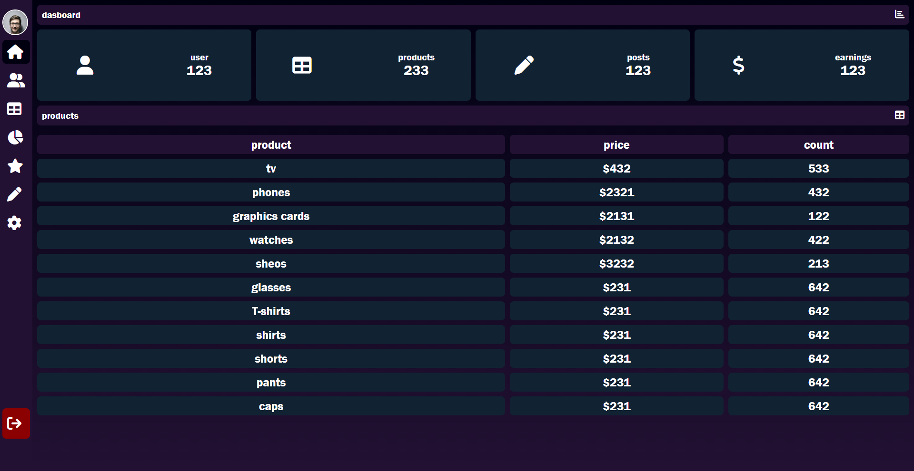
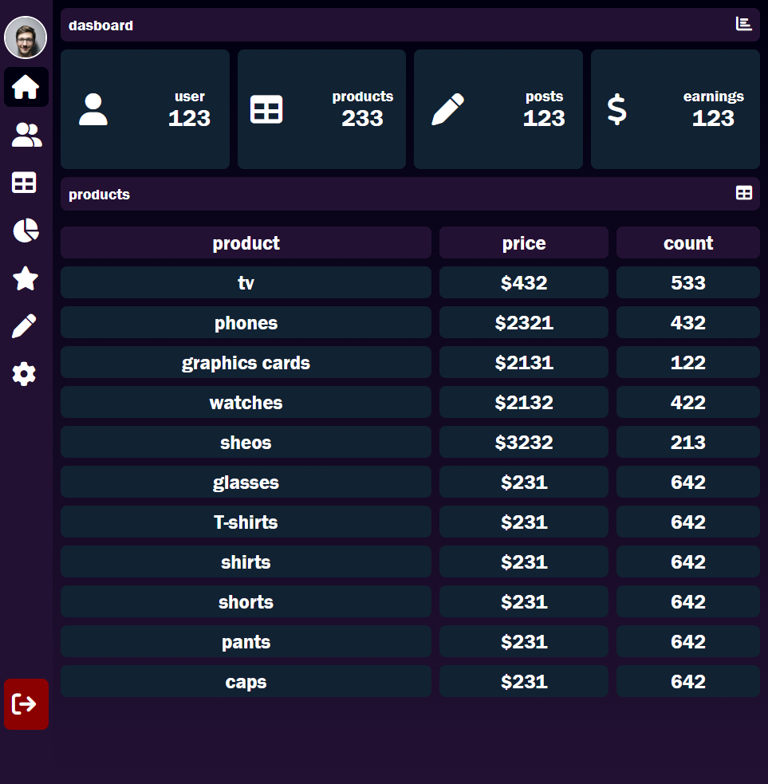

# 📊 Modern Admin Dashboard



## 📖 About the Project

A sleek and modern **Admin Dashboard** with an elegant sidebar navigation and interactive UI. Built with pure HTML and CSS featuring smooth animations, hover effects, and a responsive design. Perfect for managing products, users, and business analytics.

---

## 🌐 Live Demo

🔗 [View Demo](#)

---

## 🛠️ Tech Stack


---

## ✨ Features

- ✅ **Expandable Sidebar**: Hover to reveal full menu with smooth animations
- ✅ **User Profile Display**: Shows profile picture and username
- ✅ **Quick Stats Cards**: Display key metrics (users, products, posts, earnings)
- ✅ **Product Table**: Clean data table with hover effects
- ✅ **Modern UI**: Gradient background with purple theme
- ✅ **Icon Integration**: Font Awesome icons for better UX
- ✅ **Smooth Transitions**: CSS animations throughout
- ✅ **Logout Button**: Fixed at bottom of sidebar
- ✅ **Responsive Design**: Adapts to different screen sizes

---

## 📸 Screenshots

### Sidebar Collapsed


### Sidebar Expanded


### Dashboard Overview


---

## 🎨 Dashboard Sections

### 📱 **Sidebar Menu**
- **Dashboard**: Main overview page
- **Clients**: Client management
- **Products**: Product inventory
- **Charts**: Analytics and statistics
- **Favourites**: Saved items
- **Posts**: Content management
- **Settings**: Configuration options
- **Log Out**: Secure logout

### 📈 **Statistics Cards**
- **Users**: 123 registered users
- **Products**: 233 products in inventory
- **Posts**: 123 published posts
- **Earnings**: $123 total revenue

### 📋 **Products Table**
Displays product information including:
- Product name
- Price
- Count/Quantity

---

## ⚙️ Installation

Clone the repository:

```bash
git clone https://github.com/Mohammed-004del/admin-dashboard.git
```

Navigate to the project directory:

```bash
cd admin-dashboard
```

Open `index.html` in your browser:

```bash
# On macOS
open index.html

# On Linux
xdg-open index.html

# On Windows
start index.html
```

Or use a local server:

```bash
# Using Python 3
python -m http.server 8000

# Using Node.js (http-server)
npx http-server
```

Then open `http://localhost:8000` in your browser.

---

## 📁 Project Structure

```
admin-dashboard/
├── index.html          # Main HTML structure
├── style.css           # Styling and animations
└── images/             # Images folder
    └── proffetional profile photo.png
```

---

## 🔧 Code Highlights

### Expandable Sidebar Animation
```css
.menu {
    width: 60px;
    overflow: hidden;
    transition: 0.3s;
}

.menu:hover {
    width: 260px;
}
```

### Gradient Background
```css
body {
    background: linear-gradient(#001, #231133);
}
```

### Hover Effects
```css
.menu ul li a:hover,
.active a,
.content-boxes .box:hover,
td:hover {
    background: #001;
}
```

### Fixed Logout Button
```css
.log-out {
    position: absolute;
    bottom: 0;
    width: 100%;
}
```

---

## 🎨 Color Palette

| Color | Hex Code | Usage |
|-------|----------|-------|
| Dark Purple | `#231133` | Sidebar, headers |
| Deep Blue | `#001` | Hover effects |
| Teal | `#123` | Cards, table cells |
| Dark Red | `darkred` | Logout button |
| White | `#fff` | Text, borders |

---

## 💡 Key Features Explained

### 1. **Collapsible Sidebar**
- Default width: 60px (icon only)
- Expands to 260px on hover
- Smooth 0.3s transition

### 2. **Profile Section**
- Circular profile image with border
- Username display
- Fixed at top of sidebar

### 3. **Statistics Dashboard**
- 4 metric cards
- Icon + label + number
- Flexbox layout for responsiveness
- Hover effect for interactivity

### 4. **Data Table**
- Clean design with rounded corners
- Hover effect on rows
- Color-coded header
- Scrollable content

---

## 🚀 Future Enhancements

- Add JavaScript functionality
- Implement real data integration
- Add chart/graph visualizations
- Create settings page
- Add user authentication
- Implement search functionality
- Add filter options for table
- Create responsive mobile menu
- Add notification system
- Implement dark/light mode toggle
- Add pagination for table
- Create print-friendly views
- Add export data functionality
- Implement real-time updates

---

## 📱 Responsive Design

The dashboard is designed to work on various screen sizes:
- Desktop (1920px+)
- Laptop (1366px - 1919px)
- Tablet (768px - 1365px)
- Mobile (< 768px)

---

## 🎯 Use Cases

This dashboard template is perfect for:
- E-commerce admin panels
- Content management systems
- Business analytics platforms
- Inventory management systems
- User management interfaces
- Product catalogs
- Sales tracking systems

---

## 🤝 Contributing

Contributions are welcome! Feel free to:

1. Fork the project
2. Create your feature branch (`git checkout -b feature/AmazingFeature`)
3. Commit your changes (`git commit -m 'Add some AmazingFeature'`)
4. Push to the branch (`git push origin feature/AmazingFeature`)
5. Open a Pull Request

---

## 👨‍💻 Author

**Mohammed Mahmood Hamed**

- GitHub: [@Mohammed-004del](https://github.com/Mohammed-004del)
- LinkedIn: [Your Profile](https://linkedin.com/in/yourprofile)

---

## 📧 Contact

Have questions or suggestions? Feel free to reach out!

- Email: MohammedMahmoodHamed004@gmail.com

---

## 🙏 Acknowledgments

- Font Awesome for the amazing icons
- Inspired by modern dashboard designs
- Built with love for the web development community

---

## 📚 Resources

- [Font Awesome Icons](https://fontawesome.com/)
- [CSS Flexbox Guide](https://css-tricks.com/snippets/css/a-guide-to-flexbox/)
- [CSS Transitions](https://developer.mozilla.org/en-US/docs/Web/CSS/CSS_Transitions)

---
